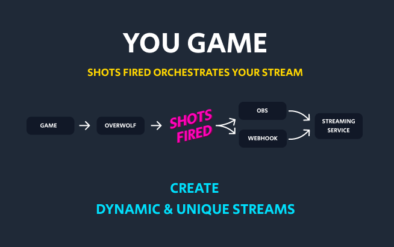

# Shots Fired

Shots Fired is an [Overwolf app](https://www.overwolf.com/) that helps to automate and enhance your gaming streams.

It was orignially developed as part of the [PUBG Developers Challenge](https://medium.com/overwolf/introducing-the-pubg-dev-challenge-a7421f1d61a1) and later expanded to support additional games.



> This documentation is for `v5.0.0` and later, you can find the version of the
> app at the bottom of the Settings page. [Documentation is still available for
> earlier versions](https://github.com/artdevgame/shots-fired-support/tree/v4.2.1).

- [Read the changelog](./CHANGELOG.md)

# Usage

## Connecting to OBS

1. Shots Fired requires [obs-websocket](https://github.com/Palakis/obs-websocket/releases) to enable automation of OBS. Choose the latest **(v4.*)** Windows installer and follow the instructions. **Please note, Shots Fired doesn't currently support (v5.*) of `obs-websocket`.**
2. After setting up a password in OBS (`Tools > Websocket server settings > Enable Authentication (checked) > Password`), enter the same password into Shots Fired
3. The address field should remain as `localhost:4444` unless you changed it in OBS
4. Click `Connect` to continue.

## Using Shots Fired

### Games

Shots Fired supports an expanding list of games.

For ease of access, you can select your favourite games to pin them to the top of the list.


### Sequences

Since **v5.x**, a user can now create a sequence of actions that are executed when an Overwolf event has been triggered.

Currently the following action types are supported:

- `delay`: A mechanism used to add a time delay between actions in a sequence.
- `obs`: A mechanism to control OBS scene and source visibility.
- `webhook`: A mechanism used to forward event data to a webserver for further processing.

With a [subscription](#subscription), a sequence can optionally be filtered by event data and shown on a randomised frequency.

### OBS

Each OBS scene can have one or more sources, for example:


When selecting a scene in Shots Fired, the app will list all the sources you have setup in OBS.

To have Shots Fired control a source, you must `activate` it:


When a source item is `ative`, Shots Fired allows you to select whether it should be visible using an on/off toggle:


At this point, you may also choose to add a delay and duration interval - both are measured in seconds.


A `delay` will add time before the source is shown i.e. if a `jump` event has occurred and your `delay` for a source item called `jump animation` is set to `3`, there will be 3 seconds that pass before OBS shows `jump animation`.

A `duration` will hide a source item after the number of seconds has passed i.e. if your `jump` event has a delay of `5`, the `jump animation` source will run for 5 seconds before hiding.

If the delay is set to `0` - the source is shown as soon as the event occurs.
If the duration is set to `0` - the source will show indefinitely.

You can preview how the configuration will look by clicking the `test` button. After saving, you can remove the configuration by clicking the `delete` button.


### Webhook

> This is an advanced feature and requires some technical knowledge

A webhook allows you to forward in-game event data to a URL of your choice.

This is useful for tracking dynamic metrics, i.e. number of kills vs number of deaths, and using the data to display in OBS with a `Browser` source. [See Example](https://www.youtube.com/watch?v=IZN7lYXm5x4).

All requests are dispatched as a `POST` with the following properties:

| Name   | Description                                            |
| ------ | ------------------------------------------------------ |
| gameId | Overwolf game id                                       |
| event  | The name of the event that was dispatched, i.e. "kill" |
| data   | The data provided by the game                          |

See [kills-death-wins](https://github.com/artdevgame/kills-death-wins) as an example of how to use this functionality in Fortnite.

### Filtering by event data

> This is an advanced feature that requires a [subscription](#subscription) and a knowledge of JavaScript programming

Write a JavaScript _function body_ that returns a boolean.

You have access to a variable called `payload` that contains the event data.

#### How to write a JavaScript function body

Below are examples of a _function_, the code that has been left uncommented is the _function body_. Returning true will cause the sequence to run, returning false will prevent the sequence from running.

```js
// always execute this sequence...

//function run (payload) {
return true;
//}
```

```js
// only execute this sequence when a condition in the data is met...

//function run (payload) {
try {
  const data = json.parse(payload)
  return data.damageDealt > 50;
} catch (err) {
  return false;
}
//}
```

### Filtering by frequency

> This feature requires a [subscription](#subscription)

To add more randomness to your stream, your sequences can be instructed to run at different frequencies.

This feature is useful if you want to have more than one sequence that responds to the same event but with different outcomes, or if you just want to create a less predictable reaction to a single event.

Choose from `rare`, `occassional`, `common` and `always`.


# <a name="subscription"></a> Supporters Tier

To help support future development of the app, Shots Fired offers a `Supporters Tier`.

A `Supporters Tier` subscription is billed monthly through the Overwolf platform. [See payment terms](https://www.overwolf.com/legal/terms).

# Support

If you've found a bug or would like to suggest a feature, [please raise an issue](https://github.com/artdevgame/shots-fired-support/issues).

You're also welcome to join the [Shots Fired Discord group](https://discord.gg/eBBnNfM).

# Terms and Conditions

This software is provided AS IS and AS AVAILABLE. There are no guarantees, warranties or refunds. Shots Fired and anyone affiliated does not accept any liability for damage or loss in any way to yourself or third parties as a result of using the app.

Shots Fired runs on Overwolf and depends on the reliability of Overwolf Events to function correctly. Sometimes those events are only partially available or not at all. Shots Fired has no control over this.

Shots Fired is owned and operated by, and copyright belongs to Mike Holloway. He reserves the right to amend these terms at any time.
