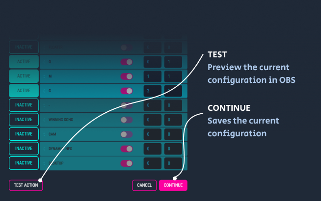

# Shots Fired

Shots Fired is an [Overwolf app](https://www.overwolf.com/) that helps to automate and enhance your gaming streams.

It was orignially developed as part of the [PUBG Developers Challenge](https://play.overwolf.com/pubg-dev-challenge/) and later expanded to support additional games.

> This documentation is for `v3.0.0` and later, you can find the version of the
> app at the bottom of the Settings page. [Documentation is still available for
> earlier versions](https://github.com/artdevgame/shots-fired-support/tree/v1.0.0).

- [Read the changelog](./CHANGELOG.md)

# Usage

## Connecting to OBS

1. Shots Fired requires [obs-websocket](https://github.com/Palakis/obs-websocket/releases) to enable automation of OBS. Choose the latest Windows installer and follow the instructions.
2. After setting up a password in OBS (`Tools > Websocket server settings > Enable Authentication (checked) > Password`), enter the same password into Shots Fired
3. The address field should remain as `localhost:4444` unless you changed it in OBS
4. Click `Connect` to continue.

## Using Shots Fired

### OBS

A mapping is a 1:1 connection between an in-game event (i.e. `jump`, [see: all events](http://developers.overwolf.com/game_events_status/game_events_status/)) and an OBS `scene`.

Each OBS scene has one or more sources, for example:

When choosing a scene, Shots Fired will list all the sources and allow you to select which ones should be visible using the on/off toggle:

At this point, you may also choose to add a delay and duration interval - both are measured in seconds.

A `delay` will add time before the source is shown i.e. if a `jump` event has occurred and your `delay` for a source item called `jump animation` is set to `3`, there will be 3 seconds that pass before OBS shows `jump animation`.

A `duration` will hide a source item after the number of seconds has passed i.e. if your `jump` event has a delay of `5`, the `jump animation` source will run for 5 seconds before hiding.

If the delay is set to `0` - the source is shown as soon as the event occurs.
If the duration is set to `0` - the source will show indefinitely.

You can preview how the mapping will look by clicking the `test` button. After saving, you can remove the mapping by clicking the `delete` button.

To temporarily disable any mapped events from triggering changes, change the toggle state in the settings page from `enabled` to
`disabled`:

### Webhook

**Requires `v4.0.0+`**

> This is an advanced supporters feature and requires some technical knowledge

A webhook allows you to forward in-game event data to a URL of your choice.

This is useful for tracking dynamic metrics, i.e. number of kills vs number of deaths, and using the data to display in OBS with a `Browser` source. [See Example](https://www.youtube.com/watch?v=IZN7lYXm5x4).

All requests are dispatched as a `POST` with the following properties:

| Name   | Description                                            |
| ------ | ------------------------------------------------------ |
| gameId | Overwolf game id                                       |
| event  | The name of the event that was dispatched, i.e. "kill" |
| data   | The data provided by the game                          |

See [kills-death-wins](https://github.com/artdevgame/kills-death-wins) as an example of how to use this functionality in Fortnite.

# Supporters Tier

To help support future development of the app, Shots Fired offers a `Supporters Tier`.

A `Supporters Tier` subscription is billed monthly through the Overwolf platform. [See payment terms](https://www.overwolf.com/legal/terms).

# Support

If you've found a bug or would like to suggest a feature, [please raise an issue](https://github.com/artdevgame/shots-fired-support/issues).

You're also welcome to join the [Shots Fired Discord group](https://discord.gg/eBBnNfM).

# Terms and Conditions

This software is provided AS IS and AS AVAILABLE. There are no guarantees, warranties or refunds. Shots Fired and anyone affiliated does not accept any liability for damage or loss in any way to yourself or third parties as a result of using the app.

Shots Fired runs on Overwolf and depends on the reliability of Overwolf Events to function correctly. Sometimes those events are only partially available or not at all. Shots Fired has no control over this.

Shots Fired is owned and operated by, and copyright belongs to Mike Holloway. He reserves the right to amend these terms at any time.
